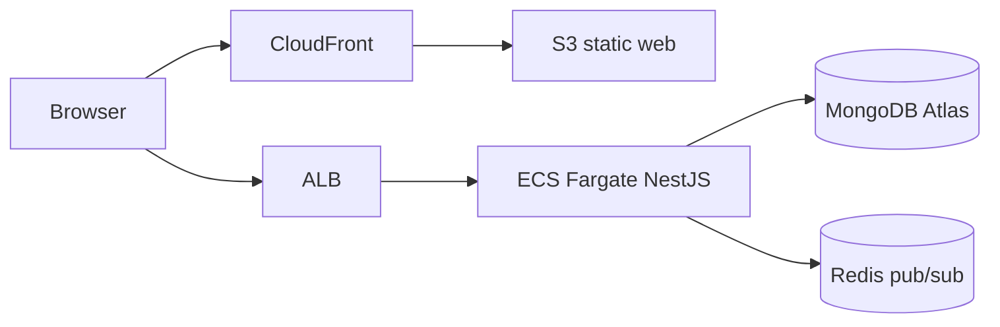
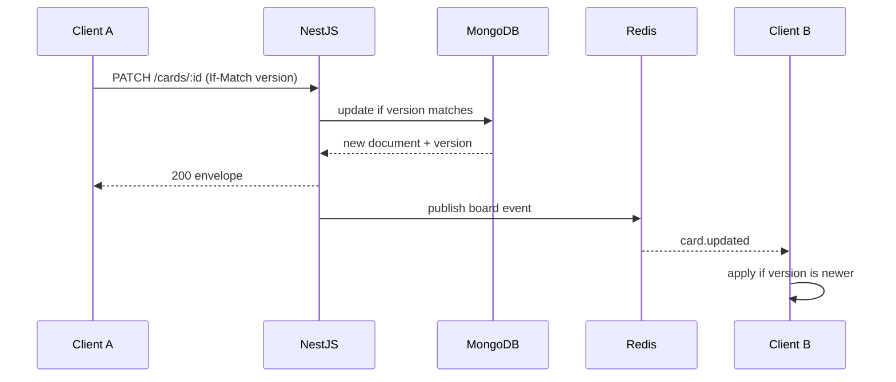
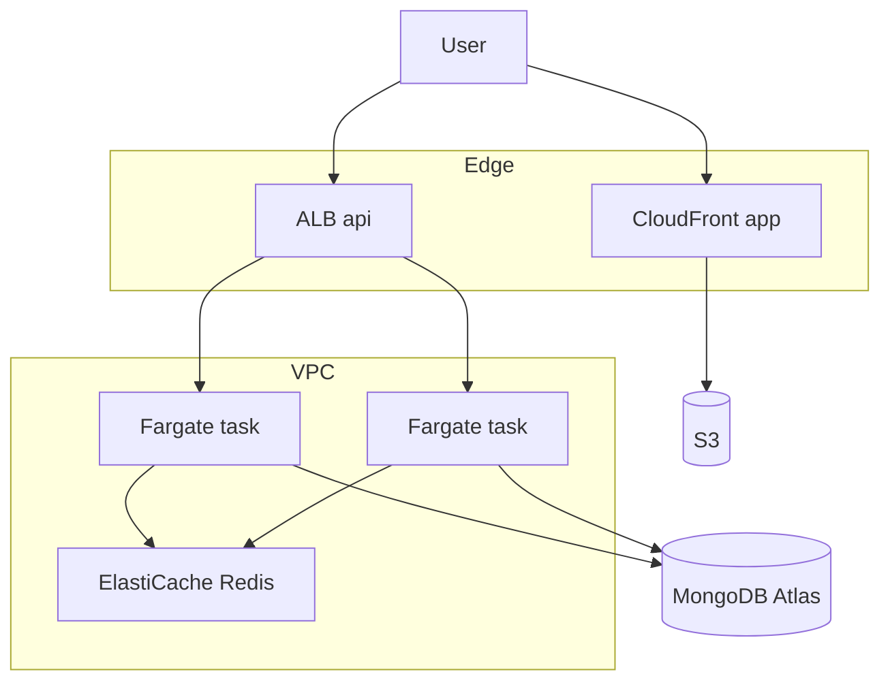

# SyncBoard Architecture Decision Records

**Product**: SyncBoard — real-time SaaS Kanban and document collaboration  
**Date**: 2026-09-22  
**Status**: accepted (v1)  
**Deciders**: SyncBoard founding team, ECC architect  

This file records the v1 system architecture. Each numbered ADR is independently readable. Later changes should supersede a specific ADR rather than silently rewriting history.

| ADR | Title | Status |
|-----|-------|--------|
| [0001](#adr-0001-mongodb-as-the-primary-datastore) | MongoDB as the primary datastore | accepted |
| [0002](#adr-0002-rest--socketio-dual-path-sync) | REST + Socket.io dual-path sync | accepted |
| [0003](#adr-0003-last-write-wins-with-version-field) | Last-write-wins with version field | accepted |
| [0004](#adr-0004-jwt-access--refresh-authentication) | JWT access + refresh authentication | accepted |
| [0005](#adr-0005-aws-ecs-fargate--alb--s3--cloudfront) | AWS ECS Fargate + ALB + S3 + CloudFront | accepted |

---

## System context

SyncBoard is a multi-tenant SaaS product. A user belongs to one or more workspaces. A workspace owns boards. A board has ordered columns and cards. Cards may link to a rich document. Collaborators see presence and comments in near real time.

**v1 entities**

- User, Workspace, Membership, Board, Column, Card, Document, Comment, Presence

**v1 clients**

- Browser SPA (`apps/web`) served from S3 + CloudFront
- NestJS API and Socket.io gateway (`apps/api`) behind an Application Load Balancer on ECS Fargate
- Shared TypeScript contracts (`packages/shared-types`)



Non-functional targets for v1 (single region):

- API p95 < 200 ms for board reads of typical size
- Card/column mutations visible to other clients in the same board < 500 ms under normal load
- Stateless API tasks so Fargate can scale horizontally
- Availability target 99.9% for the API (ALB + multi-AZ Fargate + Atlas replica set)

---

## ADR-0001: MongoDB as the primary datastore

**Date**: 2026-09-22  
**Status**: accepted  
**Deciders**: SyncBoard founding team, ECC architect  

### Context

Boards, cards, and documents are hierarchical, frequently nested, and evolve without a rigid relational schema. Reads are mostly “load this board and its columns/cards.” Writes are frequent, small, and scoped to one workspace. We need a document model that maps cleanly to TypeScript interfaces and to Socket.io payloads, without a heavy migration story in v1.

### Decision

We use **MongoDB Atlas** (replica set, one primary region matching the ECS region) as the system of record. NestJS talks to Mongo through a repository layer (Mongoose or the official driver wrapped behind ports). Kanban structure and document bodies live in Mongo collections. Redis is **not** the source of truth; it is only a Socket.io adapter and optional cache.

Recommended collections: `users`, `workspaces`, `memberships`, `boards`, `columns`, `cards`, `documents`, `comments`, `refresh_tokens` (or hashed refresh sessions).

### Alternatives considered

#### Alternative 1: PostgreSQL (relational + JSONB)

- **Pros**: Strong transactions, mature constraints, easier reporting, cheaper “accidental” consistency.
- **Cons**: Board trees need recursive queries or JSONB blobs; schema migrations are heavier for rapidly changing card fields.
- **Why not**: v1 access patterns are document-shaped. We accept weaker relational integrity in exchange for simpler aggregates.

#### Alternative 2: Amazon DocumentDB

- **Pros**: AWS-native, Mongo-compatible API, VPC-only.
- **Cons**: Not full MongoDB (no Atlas search, limited change streams / operators), operational lock-in, historically lagging compatibility.
- **Why not**: We want real MongoDB features (change streams as a later fan-out option, Atlas backups). Atlas in a VPC peering / PrivateLink setup is enough for v1.

#### Alternative 3: Self-managed MongoDB on ECS/EC2

- **Pros**: Full control, no Atlas cost.
- **Cons**: Replica-set ops, backups, and failover become our problem on day one.
- **Why not**: Too much undifferentiated ops for a SaaS v1.

### Consequences

#### Positive

- Board/card/document shapes map 1:1 to shared TypeScript types.
- Workspace-scoped documents scale by sharding key later (`workspaceId`).
- Atlas handles backups, point-in-time restore, and replica failover.

#### Negative

- Cross-document transactions exist but are not as natural as SQL.
- Multi-document board moves (card + column counts) need explicit transaction boundaries.
- Analytics/reporting will eventually need a warehouse export.

#### Risks

- **Unbounded board documents** if we nest all cards inside one board document → mitigate by **normalized collections** (board, columns, cards) with `boardId` indexes, not a single mega-document.
- **Tenant leakage** → every query requires `workspaceId` (and membership check) in the repository, never only `_id`.
- **Atlas network exposure** → PrivateLink or IP-restricted peering from the ECS VPC; no public write from the browser.

---

## ADR-0002: REST + Socket.io dual-path sync

**Date**: 2026-09-22  
**Status**: accepted  
**Deciders**: SyncBoard founding team, ECC architect  

### Context

Clients must load boards reliably, mutate cards, and see other users’ moves without refresh. Pure WebSocket APIs are hard to cache, debug, and authorize. Pure REST cannot push presence or live card moves. ECS will run **multiple** Fargate tasks, so in-memory Socket.io rooms would split the fleet.

### Decision

We use a **dual path**:

1. **REST `/api/v1`** is the authority for commands and queries (create board, move card, save document metadata, auth).
2. **Socket.io** is the live fan-out and presence channel. After a successful REST mutation (or an equivalent gateway-handled command that still writes through the same service/repository), the API emits a typed event to the board room.

Socket.io rooms are keyed by `board:{boardId}` and `workspace:{workspaceId}`. The gateway authenticates with the access JWT on handshake.

**Scale-out**: enable the **Socket.io Redis adapter**. ALB uses **sticky sessions** (`AWSALB` cookie) as a first-hop optimization so upgrades and polling fallbacks stay on one task, but Redis is what makes broadcasts correct across tasks. Do not rely on stickiness alone.

Client rule: REST is how you persist; sockets are how you observe. A client that misses a socket event recovers by re-fetching the board (`GET /api/v1/boards/:id`).



### Alternatives considered

#### Alternative 1: Socket.io only (no REST mutations)

- **Pros**: One protocol, lower latency for every write.
- **Cons**: Poor HTTP caching, harder rate limits, messy file uploads, worse observability.
- **Why not**: Auth, billing, and CRUD are HTTP-native. Dual path is clearer.

#### Alternative 2: Server-Sent Events + REST

- **Pros**: Simpler than sockets, HTTP/2 friendly.
- **Cons**: One-way; presence and client-originated realtime still need another channel; proxy buffering on ALB/CloudFront is easy to get wrong.
- **Why not**: Collaboration needs bidirectional presence and typing indicators.

#### Alternative 3: MongoDB Change Streams as the bus

- **Pros**: True “DB is the log.”
- **Cons**: Atlas cost, resume-token ops, harder to shape client events, couples UI protocol to storage.
- **Why not**: Keep as a future option for audit/outbox; v1 emits from the application service after a successful write.

### Consequences

#### Positive

- Browsers, tests, and future mobile clients can use REST without a socket.
- Live UX is still sub-second for connected peers.
- Horizontal scale is a Redis problem, not an affinity problem.

#### Negative

- Two network stacks to secure (HTTP CORS/CSRF + WS origin).
- Clients must handle dual updates (own REST response + echo of the socket event) without double-applying.

#### Risks

- **Split brain across tasks** without Redis → Redis adapter is required before the second Fargate task.
- **CloudFront in front of WebSockets** → terminate TLS for sockets on **ALB**, not CloudFront. CloudFront serves only the SPA and hashed assets.
- **Reconnect storms** → exponential backoff and board snapshot on `connect`.

---

## ADR-0003: Last-write-wins with version field

**Date**: 2026-09-22  
**Status**: accepted  
**Deciders**: SyncBoard founding team, ECC architect  

### Context

Two users may move the same card, rename a column, or edit card fields at once. We need a conflict rule that is simple to implement, explain, and test. True CRDT/OT is the right tool for concurrent character-level document editing, not for v1 Kanban structure.

### Decision

Every mutable entity implements `VersionedEntity`:

- `version: number` starts at `1` and increments on every successful write.
- Updates **must** send the version the client last observed (`expectedVersion`).
- The repository updates **only if** `version === expectedVersion`. On mismatch it returns `409 Conflict` with the current document.
- The accepted write is the winner (**last successful write**, not “latest wall clock”). Stale clients must re-fetch, rebase, and retry.

This is **optimistic concurrency** with last-accepted-write semantics. We do not merge field-level patches on the server in v1.

**Scope of LWW**

- In scope: board title, column order, card position (`columnId`, `rank`), card fields, comments as append-only records, presence (ephemeral, no version).
- Out of scope: concurrent rich-text in `documents.body`. v1 treats document saves as whole-document LWW **or** single-writer recommendation. A later ADR may introduce Yjs/Automerge/OT for the editor.

**Ordering of cards**: use a string `rank` (fractional indexing) plus `version` so inserts between cards do not require rewriting the whole column.

### Alternatives considered

#### Alternative 1: Operational Transform / CRDT for everything

- **Pros**: Automatic merge, Google-Docs-like UX.
- **Cons**: High complexity, large payloads, hard debugging, overkill for card moves.
- **Why not**: Defer to a document-editing ADR. Kanban ops are coarse.

#### Alternative 2: Pessimistic locks (checkout / mutex)

- **Pros**: No silent overwrites.
- **Cons**: Abandoned locks, poor multi-tab UX, extra Redis lock infrastructure.
- **Why not**: Collaboration should not serialize the whole board.

#### Alternative 3: Timestamps only (no version)

- **Pros**: Trivial.
- **Cons**: Clock skew, lost updates when two writes share a timestamp window, no client-side “I edited from stale state” detection.
- **Why not**: Version integers are deterministic and cheap.

### Consequences

#### Positive

- Easy to test: seed version N, send N-1, expect 409.
- Lost updates are visible, not silent.
- Works identically over REST and over socket-originated commands that hit the same service.

#### Negative

- Users can lose in-flight field edits if they retry blindly after 409.
- Whole-document LWW is a poor typing experience.

#### Risks

- **UI must rebase**, not clobber. On 409, merge locally or show “board changed, reload.”
- **Document editor** may feel broken if two people type in one doc → product copy: v1 docs are “save-based”; schedule CRDT as ADR-0006 when the editor ships.
- **Rank + version races** (two inserts, same rank) → generate unique ranks client-side with jitter; server rejects duplicates with 409 and a new rank hint.

---

## ADR-0004: JWT access + refresh authentication

**Date**: 2026-09-22  
**Status**: accepted  
**Deciders**: SyncBoard founding team, ECC architect  

### Context

The SPA on CloudFront and the API on ALB are different origins. We need short-lived authorization for REST and Socket.io, the ability to revoke sessions, and no long-lived tokens in `localStorage` if we can avoid it.

### Decision

- **Access token**: JWT, ~15 minutes, signed with RS256 (private key in AWS Secrets Manager / SSM). Claims: `sub`, `email`, `workspaceIds` or a thin `sub` only (prefer thin; load memberships from DB). Sent as `Authorization: Bearer` on REST and as Socket.io `auth.token` on handshake.
- **Refresh token**: opaque random (256-bit), stored **hashed** in Mongo (`refresh_sessions`), TTL ~30 days. Delivered in an **httpOnly, Secure, SameSite=None** cookie (cross-site SPA ↔ API) **or** returned in the JSON body for native clients. Browser v1 uses the httpOnly cookie + `POST /api/v1/auth/refresh`.
- **Rotation**: each refresh issues a new refresh token and revokes the previous (reuse detection: if a revoked token is presented, revoke the whole family).
- **CSRF**: cookie refresh is a state-changing request. Require a custom header (`X-Requested-With` or double-submit CSRF) on `/auth/refresh` and `/auth/logout`. Access token in `Authorization` is not sent by naive form posts.
- **Logout**: delete server session hash; client drops memory-held access token.
- **Guards**: NestJS `JwtAuthGuard` on HTTP; gateway middleware on connect. Workspace authorization is a separate guard (`MembershipGuard`) on every board/card route.

Password hashing: Argon2id. Rate limit `/auth/login` and `/auth/refresh`.

### Alternatives considered

#### Alternative 1: Session cookies only (server sessions)

- **Pros**: Easy revoke, no JWT debugging.
- **Cons**: Socket.io handshake and future mobile apps get messier; sticky sessions become more important.
- **Why not**: We still want a bearer token for the gateway and APIs. Refresh sessions give us revocation without putting the session store on every request.

#### Alternative 2: Access JWT only (long-lived)

- **Pros**: Simple.
- **Cons**: Cannot revoke; XSS steals a long-lived bearer.
- **Why not**: Unacceptable for SaaS.

#### Alternative 3: OAuth-only (Cognito/Auth0)

- **Pros**: Delegated MFA, social login, threat detection.
- **Cons**: Cost, vendor UX, slower iteration on memberships.
- **Why not**: v1 ships first-party email/password (+ optional magic link). Design `sub` so Cognito can replace the IdP later without rewriting memberships.

### Consequences

#### Positive

- Short access window limits stolen-token blast radius.
- Refresh rotation enables family revocation.
- Same JWT authenticates REST and sockets.

#### Negative

- Clock skew and key rotation (use `kid` in JWT header; keep previous public key during rollout).
- Cross-site cookies need HTTPS and correct CORS (`credentials: true`, explicit origin allowlist — never `*`).

#### Risks

- **XSS stealing access JWT from memory** is still possible via malicious scripts → strict CSP on the SPA, no token in `localStorage`.
- **ALB + cookie stickiness collision** with refresh cookie → use distinct cookie names (`sb_refresh` vs AWS stickiness).
- **Memberships baked into JWT** go stale → keep JWT thin; authorize from Mongo on each mutating request.

---

## ADR-0005: AWS ECS Fargate + ALB + S3 + CloudFront

**Date**: 2026-09-22  
**Status**: accepted  
**Deciders**: SyncBoard founding team, ECC architect  

### Context

We need a boring, horizontally scalable deploy for a Node API with WebSockets and a static SPA. We do not want to manage EC2 capacity. Static assets should be served from a CDN, not from NestJS.

### Decision

| Piece | Role |
|-------|------|
| S3 | Host Vite build (`apps/web`) |
| CloudFront | TLS, caching, SPA fallback (`index.html` for 404 on GET) |
| ALB | TLS for API, HTTP + WebSocket to Fargate, health checks, stickiness |
| ECS Fargate | NestJS tasks in a private subnet, autoscaling on CPU/ALB RPS |
| Elasticache Redis | Socket.io adapter (and later cache) |
| MongoDB Atlas | Primary datastore, peered to the VPC |
| Secrets Manager | JWT keys, Mongo URI, Redis URI |
| ECR | API image |
| CloudWatch | Logs, ALB metrics, alarms |

DNS: `app.example.com` → CloudFront (SPA). `api.example.com` → ALB (API + `/socket.io`).

Fargate tasks are **stateless**. Desired count ≥ 2 in production across two AZs. CI builds and pushes the API image, runs migrations/indexes, then rolls ECS. Frontend deploy is a separate S3 sync + CloudFront invalidation of `index.html`.



### Alternatives considered

#### Alternative 1: EC2 / ECS on EC2

- **Pros**: Slightly cheaper at high steady load, more networking control.
- **Cons**: Patching, capacity providers, slower scale-from-zero.
- **Why not**: Fargate cost is acceptable until we have stable utilization data.

#### Alternative 2: Lambda + API Gateway

- **Pros**: Pay-per-request, no task ops.
- **Cons**: WebSocket APIs are a different product; Socket.io does not map cleanly; cold starts; 29 s HTTP limits.
- **Why not**: Realtime collaboration is a long-lived connection workload.

#### Alternative 3: Vercel/Netlify SPA + single VPS

- **Pros**: Fastest prototype.
- **Cons**: Weak multi-AZ story, DIY TLS/WS, not the requested AWS target.
- **Why not**: Conflicts with the chosen infra; fine for local demo only.

### Consequences

#### Positive

- SPA and API scale independently.
- CDN caches hashed JS/CSS forever (`immutable`).
- Fargate + ALB is a well-trodden Socket.io pattern when Redis + stickiness are both enabled.

#### Negative

- Two deploy pipelines and two hostnames.
- AWS bill includes ALB hours even at low traffic.
- NAT Gateway cost for private tasks reaching Atlas if not using PrivateLink carefully.

#### Risks

- **Idle WebSockets killed** by ALB idle timeout (default 60s) → raise idle timeout (e.g. 400s) and enable Socket.io ping/pong inside that window.
- **Rolling deploys drop sockets** → accept reconnect; clients snapshot on reconnect. Use minimum healthy percent so one task always serves.
- **CloudFront caching `index.html` too long** → short TTL or invalidate on each release.

---

## Cross-cutting rules

### API envelope

All JSON HTTP responses use:

```ts
{
  success: boolean;
  data: T | null;
  error: { code: string; message: string } | null;
  meta: { page?: number; limit?: number; total?: number } | null;
}
```

Public REST is versioned under `/api/v1`. Resources are plural nouns. Mutations that fail optimistic concurrency return `409` with `error.code = 'VERSION_CONFLICT'` and `data` = current entity.

### Architecture pattern

- **Inbound adapters**: HTTP controllers, Socket.io gateway.
- **Application services**: board/card/document use cases, no Socket.io or Express types.
- **Outbound ports**: repositories, token hasher, clock.
- **Infrastructure**: Mongo repositories, Redis pub/sub, JWT signer.

Feature modules in NestJS stay the composition root for each domain. Do not put Mongo schemas in `packages/shared-types`.

### Security baseline

- Validate DTOs with a global ValidationPipe (`whitelist`, `forbidNonWhitelisted`).
- Rate-limit auth and write endpoints.
- Sanitize any HTML stored in documents before render.
- No secrets in git; fail boot if `JWT_PRIVATE_KEY`, `MONGO_URI`, or `REDIS_URI` are missing.
- CORS allowlist of the CloudFront origin.

### What v1 will not do

- CRDT document editing
- Multi-region active-active Mongo
- GraphQL
- Search cluster (Atlas Search can be ADR later)
- Putting NestJS behind CloudFront for WebSockets

---

## Monorepo layout

**Package manager**: **pnpm workspaces**. Fast, strict, and standard for `apps/*` + `packages/*`. Root `pnpm-workspace.yaml` includes `apps/*` and `packages/*`.

```text
syncboard/
├── apps/
│   ├── api/                         # NestJS
│   └── web/                         # React + Vite
├── packages/
│   └── shared-types/                # DTOs and socket contracts only
├── docs/
│   ├── ADR.md
│   └── PROGRESS.md
├── package.json
├── pnpm-workspace.yaml
└── tsconfig.base.json
```

### `apps/api` (NestJS)

```text
apps/api/
├── src/
│   ├── main.ts
│   ├── app.module.ts
│   ├── common/
│   │   ├── filters/http-exception.filter.ts
│   │   ├── interceptors/envelope.interceptor.ts
│   │   ├── guards/jwt-auth.guard.ts
│   │   ├── guards/membership.guard.ts
│   │   └── pipes/
│   ├── config/
│   │   ├── configuration.ts
│   │   └── validation.ts
│   └── modules/
│       ├── auth/
│       │   ├── auth.module.ts
│       │   ├── auth.controller.ts
│       │   ├── auth.service.ts
│       │   ├── dto/
│       │   └── strategies/
│       ├── users/
│       ├── workspaces/
│       ├── boards/
│       ├── columns/
│       ├── cards/
│       ├── documents/
│       ├── comments/
│       ├── presence/
│       └── realtime/
│           ├── realtime.gateway.ts
│           └── realtime.module.ts
├── test/
│   ├── unit/
│   ├── integration/
│   └── e2e/
├── Dockerfile
└── package.json
```

Each feature module owns `*.controller.ts`, `*.service.ts`, `*.repository.ts` (Mongo adapter), and `dto/`. Repositories implement ports defined next to the service. Tests: unit tests beside the file or under `test/unit` mirroring `src`; integration tests hit Mongo (testcontainers or Atlas test DB); e2e tests hit HTTP + a test Socket.io client.

### `apps/web` (React + Vite)

```text
apps/web/
├── src/
│   ├── main.tsx
│   ├── app/
│   │   ├── App.tsx
│   │   ├── router.tsx
│   │   └── providers.tsx
│   ├── features/
│   │   ├── auth/
│   │   ├── boards/
│   │   ├── cards/
│   │   ├── documents/
│   │   └── presence/
│   ├── shared/
│   │   ├── api/client.ts
│   │   ├── realtime/socket.ts
│   │   ├── ui/
│   │   └── lib/versioned-update.ts
│   └── styles/
├── index.html
├── vite.config.ts
└── package.json
```

Organize by **feature**, not by `components/` vs `hooks/` at the top level. The API client always sends `expectedVersion` on PATCH. The socket client ignores echoed events for the local mutation id when the REST response already applied.

### `packages/shared-types`

```text
packages/shared-types/
├── src/
│   ├── index.ts
│   ├── api.ts
│   ├── auth.ts
│   ├── board.ts
│   ├── realtime.ts
│   └── versioned.ts
├── package.json
└── tsconfig.json
```

No runtime Nest/React imports. This package emits types (and optionally const enums for event names).

---

## Shared types (sketch)

```ts
export interface ApiResponse<T> {
  success: boolean;
  data: T | null;
  error: { code: string; message: string } | null;
  meta: { page?: number; limit?: number; total?: number } | null;
}

export interface VersionedEntity {
  id: string;
  version: number;
  updatedAt: string;
  updatedBy: string;
}

export interface User {
  id: string;
  email: string;
  name: string;
  createdAt: string;
}

export interface Workspace {
  id: string;
  name: string;
  createdAt: string;
}

export type MembershipRole = 'owner' | 'admin' | 'member' | 'guest';

export interface Membership {
  id: string;
  workspaceId: string;
  userId: string;
  role: MembershipRole;
}

export interface Board extends VersionedEntity {
  workspaceId: string;
  title: string;
}

export interface Column extends VersionedEntity {
  boardId: string;
  title: string;
  rank: string;
}

export interface Card extends VersionedEntity {
  boardId: string;
  columnId: string;
  title: string;
  description?: string;
  rank: string;
  documentId?: string;
  assigneeId?: string;
}

export interface Document extends VersionedEntity {
  workspaceId: string;
  boardId?: string;
  title: string;
  body: string; // v1 whole-document LWW; not a CRDT
}

export interface Comment extends VersionedEntity {
  cardId: string;
  authorId: string;
  body: string;
}

export interface Presence {
  boardId: string;
  userId: string;
  displayName: string;
  cardId?: string;
  updatedAt: string;
}

export interface AuthTokens {
  accessToken: string;
  expiresIn: number;
  tokenType: 'Bearer';
}

export const SocketEvents = {
  BOARD_JOIN: 'board:join',
  BOARD_LEAVE: 'board:leave',
  CARD_UPDATED: 'card:updated',
  CARD_CREATED: 'card:created',
  CARD_DELETED: 'card:deleted',
  COLUMN_UPDATED: 'column:updated',
  PRESENCE_SYNC: 'presence:sync',
  VERSION_CONFLICT: 'entity:conflict',
} as const;

export type SocketEventName = (typeof SocketEvents)[keyof typeof SocketEvents];
```

---

## Testing stance (architecture)

- **Unit**: version increment and 409 path in card/board services with fake repositories.
- **Integration**: Mongo unique indexes, refresh rotation, workspace isolation.
- **E2E**: login → create board → two socket clients, one stale PATCH expects 409 and the other sees `card:updated`.

Coverage target remains 80%+ once code exists. This ADR does not replace tests.

---

## Open questions (non-blocking)

1. Email provider for magic links (SES vs Postmark) — not required to start email/password.
2. File attachments: S3 direct upload vs API proxy — defer until cards need files.
3. Observability vendor (CloudWatch-only vs Grafana Cloud) — start with CloudWatch.
4. Document CRDT library when the editor is scheduled — likely Yjs; new ADR at that time.

## Next implementation order

1. Root pnpm workspace + `packages/shared-types`
2. `apps/api` Nest skeleton, auth module, Mongo connection
3. Boards/columns/cards with versioned repositories
4. Socket.io gateway + Redis adapter
5. `apps/web` Vite app, auth, board UI, socket client
6. Terraform/CDK for ALB/ECS/S3/CloudFront (separate infra ADR if the tool choice needs debate)
